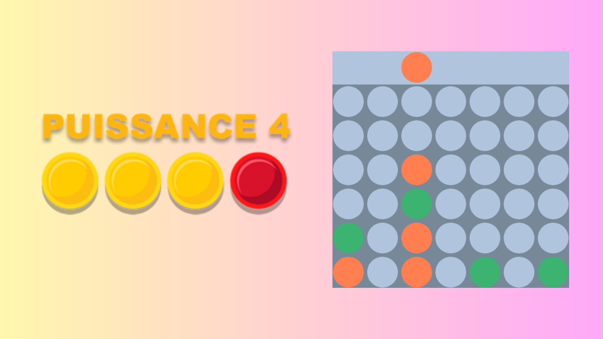
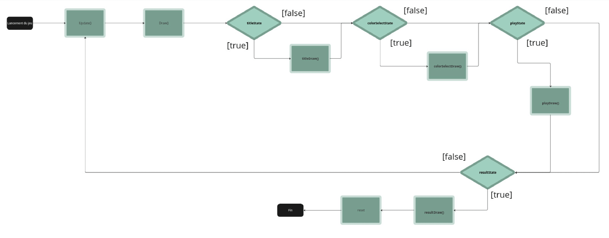
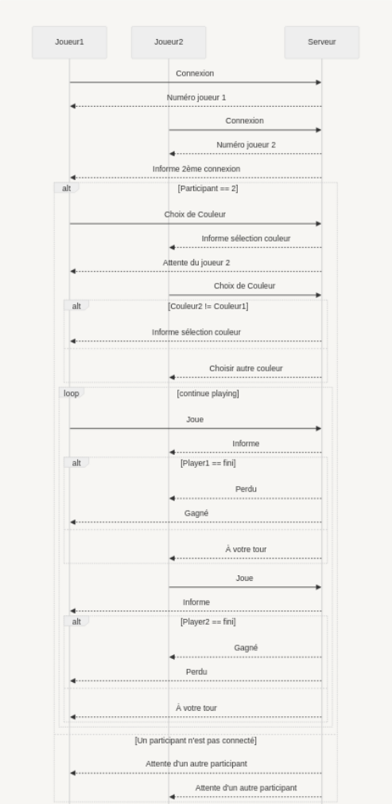

# Projet Puissance 4 Multijoueur en GO

<div style="display: flex; align-items: center;">
    
    
</div>

[](readmefile/Puissance4.mp4)

## Lancement du Projet

Pour démarrer le projet, lancez le serveur et les deux clients.

### Serveur

Dans le dossier `/serveur`, exécutez la commande :

```sh
go run server.go
```

### Client

Dans le dossier `/client`, exécutez la commande suivante, pour obtenir un exécutable permettant de lancer l'application (assurer vous d'avoir la version 1.21.3 sinon changer la version dans le fichier `/client/go.mod`) :

```sh
go build
```

## Fonctionnement d'Ebitengine



## Fonctionnement du Client-Serveur


